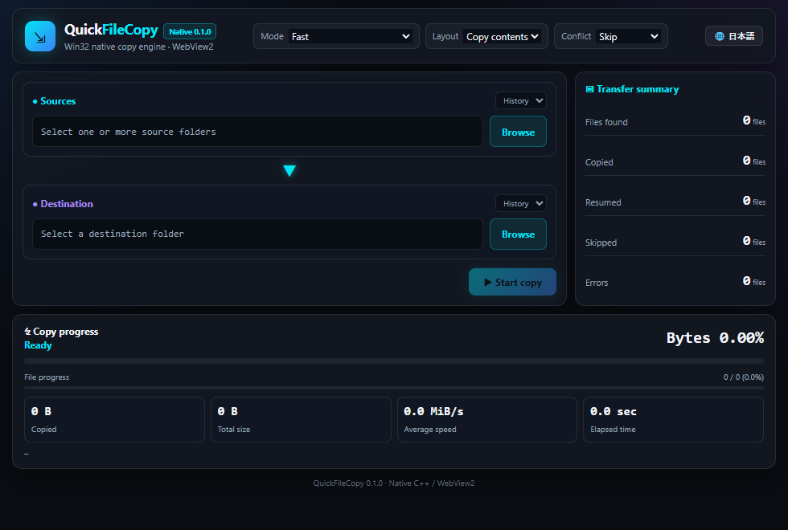

# QuickFileCopy
[日本語版 README_jp.md](README_jp.md)

QuickFileCopy is a native high-speed file copy application for Windows 10 and 11. It focuses on a compact workflow, visible byte/file progress, safe replacement, and Windows metadata preservation without requiring Python at runtime.

Version: **v1.0.0**

The GUI and documentation support English and Japanese; the QDB-style language button keeps the selected language across restarts.

<p align="center">
  
</p>

## Features

- Native C++20 copy engine shared by the WebView2 GUI and CLI
- Instant English/Japanese UI switching with persistent language preference
- Concurrent directory scanning and bounded parallel copying
- Skip, overwrite, and overwrite-if-newer conflict policies
- Copy folder contents into an existing backup folder, or include each source folder itself
- SHA-256 verification after flushing the temporary destination file
- Safe same-directory temporary files followed by atomic replacement
- ACL/owner/group/SACL, ADS, EA, EFS, reparse point, hard-link, sparse-file, and NTFS compression preservation
- Automatic resume journal for completed files after interruption
- SMB compression requests, adaptive worker counts, and unbuffered large local copies
- Privileged preallocation for eligible local files of 512 MiB or larger in complete-preservation modes

## Using the binary release

If you only want to run the app, download the ZIP from GitHub Releases. GitHub Actions builds `QuickFileCopy-binary.zip` on a `v*` tag; the ZIP is not stored in this repository.

- [Latest releases](https://github.com/maktak-105/QuickFileCopy/releases)
- [v1.0.0](https://github.com/maktak-105/QuickFileCopy/releases/tag/v1.0.0)
- [Direct download of QuickFileCopy-binary.zip](https://github.com/maktak-105/QuickFileCopy/releases/download/v1.0.0/QuickFileCopy-binary.zip)

Extract every file into the same folder and run `QuickFileCopy.exe`.

- `QuickFileCopy.exe` - WebView2 GUI
- `QuickFileCopy_cli.exe` - command-line interface
- `WebView2Loader.dll` - WebView2 loader
- `readme.txt` / `readme_jp.txt` - user documentation
- `history.txt` / `history_jp.txt` - change log
- `LICENSE.txt` / `LICENSE_jp.txt` - license files

### Integrity verification (SHA-256)

Official SHA-256 checksums for the distribution ZIP and binaries are automatically computed during the CI (GitHub Actions) build and published as `SHA256SUMS.txt` on each release page. Verify the downloaded package with PowerShell:

```powershell
Get-FileHash .\QuickFileCopy-binary.zip -Algorithm SHA256
```

The GUI HTML is embedded in `QuickFileCopy.exe`; an external `index.html` is not required.

## GUI usage

1. Select one or more source folders.
2. Select the destination folder.
3. Choose `contents` to update the destination directly, or `folder` to create source folders below it.
4. Choose a conflict policy and copy mode.
5. Start the copy and monitor both byte and file progress.

Complete-preservation modes launch a separate elevated worker through UAC. The main GUI itself remains unelevated.

## CLI usage

```powershell
.\dist\QuickFileCopy_cli.exe --help
.\dist\QuickFileCopy_cli.exe copy C:\Source D:\Backup --contents --policy newer
.\dist\QuickFileCopy_cli.exe copy C:\Source D:\Backup --folder --policy overwrite --verify
```

## Build

Requirements:

- Windows 10 or 11, 64-bit
- Python 3.11 or later for the build scripts
- MinGW-w64, validated with WinLibs MCF/UCRT
- Microsoft WebView2 SDK headers and `WebView2Loader.dll`

```powershell
winget install --id BrechtSanders.WinLibs.MCF.UCRT --exact --source winget
scripts\build.bat
```

The default WebView2 SDK root is `C:\tools\webview2\build\native`. Override it with `WEBVIEW2_ROOT`, `WEBVIEW2_INCLUDE`, or `WEBVIEW2_LOADER`.

Build outputs are written to `dist/`. Run the smoke tests after building:

```powershell
python proto\tests\native_smoke.py
```

Detailed specifications and build notes are in [`docs/`](docs/).

## Project layout

```text
QuickFileCopy/
├── src/
│   ├── app/              GUI host & Windows resources (main_gui.cpp, .rc, .ico, resource.h)
│   ├── cli/              CLI entry point (main_cli.cpp)
│   ├── engine/           Copy engine and qfc/ header (copy_engine.cpp, qfc/copy_engine.h)
│   └── ui/               UI source files (index.html, css/, js/, img/)
├── proto/
│   ├── prototype/        archived Python/PySide6 prototype
│   ├── tests/            native CLI smoke and benchmark runners
│   └── benchmark/        historical Python prototype measurements
├── scripts/              build.py, build.bat, bundle_html.py
├── docs/                 specification, environment, and version information
│   └── distribution/     user-facing distribution documents
├── dist/                 generated binaries, excluded from source control (except .gitkeep)
└── .github/workflows/    CI and release workflows
```

## License and disclaimer

MIT License. See [`LICENSE`](LICENSE) and [`dist/documents/LICENSE_jp.txt`](dist/documents/LICENSE_jp.txt).

This software is provided as-is. The author assumes no responsibility for data loss, system failure, hardware damage, or other damages. Back up important data and test with non-critical files before use.

## Design philosophy

- Keep the normal workflow limited to source, destination, mode, layout, and conflict policy.
- Preserve Windows-specific file semantics instead of treating every item as plain byte data.
- Make cancellation and replacement safe before pursuing benchmark numbers.
- Select specialized paths only where the storage and file type can benefit; otherwise fall back to Windows copy APIs.
